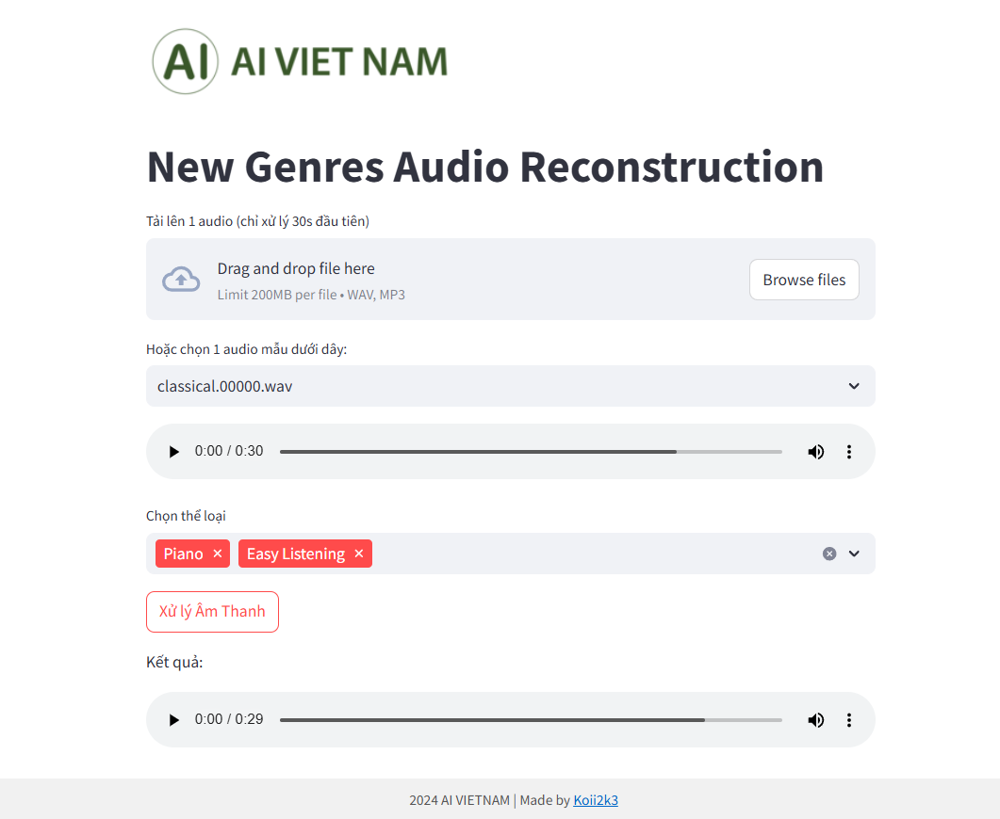

# Audio Genre Reconstruction with CVAE Streamlit App

## Overview

This Streamlit application demonstrates audio reconstruction using a Conditional Variational Autoencoder (CVAE) model. The application allows users to upload an audio file or select a sample audio, choose target genres, and then reconstruct the audio based on the selected genres. This project is designed to showcase the potential of generative models in audio processing and manipulation.

## Features

- **Audio Upload:** Users can upload their own audio files in `.wav` or `.mp3` format.
- **Sample Audios:** The application provides sample audio files for users to quickly test the functionality.
- **Genre Selection:** Users can select multiple genres from a predefined list to guide the audio reconstruction process.
- **Audio Reconstruction:** Utilizes a pre-trained CVAE model to reconstruct the input audio based on the chosen genres.
- **Audio Playback:**  Allows users to listen to both the original and the reconstructed audio directly in the application.
- **User-Friendly Interface:** Built with Streamlit for an intuitive and easy-to-use web interface.

## Demo Images


## How to Use

1. **Installation:**
   - Make sure you have Python installed (preferably Python 3.8 or higher).
   - Clone this repository to your local machine.
   - Navigate to the project directory in your terminal.
   - Install the required Python packages using pip:
     ```bash
     pip install -r requirements.txt
     ```

2. **Running the Application:**
   - In your terminal, within the project directory, run the Streamlit app:
     ```bash
     streamlit run app.py
     ```

3. **Using the Application:**
   - **Upload Audio or Select Sample:**
     - You can either upload an audio file by clicking on the "Tải lên 1 audio" (Upload an audio) button and selecting a `.wav` or `.mp3` file from your computer.
     - Alternatively, you can choose a sample audio from the dropdown menu "Hoặc chọn 1 audio mẫu dưới dây:" (Or select a sample audio below). Select "Không chọn audio mẫu" (Do not select sample audio) to disable sample audio.
   - **Select Genres:**
     - Choose the desired genres from the "Chọn thể loại" (Select genre) multi-select dropdown. You can select multiple genres.
   - **Process Audio:**
     - Click the "Xử lý Âm Thanh" (Process Audio) button.
     - The application will process the audio, split it into segments, reconstruct it based on the selected genres using the CVAE model, and display the reconstructed audio.
   - **Listen to Audio:**
     - Use the audio players provided to listen to both the original (if uploaded) and the reconstructed audio.

## Project Structure
```
   ├── app.py # Main Streamlit application file 
    ├── model/ # Directory containing the CVAE model 
    │ └── model.py # Definition of the CVAE model 
    │ └── model_256.pth # Pre-trained CVAE model weights 
    ├── audios_samples/ # Directory containing sample audio files 
    │ └── ... # Sample audio files (.wav, .mp3) 
    ├── static/ # Directory for static files (images, favicon) │ 
    ├── aivn_favicon.png 
    │ └── aivn_logo.png 
    ├── utils.py # Utility functions for audio processing and model interaction 
    ├── requirements.txt # List of Python dependencies 
    └── readme.md # This README file
```

## Dependencies

- streamlit
- numpy
- torch
- torchaudio
- librosa

You can install all dependencies using:

```bash
pip install -r requirements.txt
```

## Model
- The application uses a Conditional Variational Autoencoder (CVAE) model trained for audio reconstruction based on genre conditioning. The pre-trained model weights (model/model_256.pth) are included in the repository. The model architecture is defined in model/model.py.

## Sample Audios
- The audios_samples/ directory contains sample audio files that you can use to test the application. Feel free to add your own sample audio files to this directory.

## Note
- The application processes only the first 30 seconds of uploaded audio files to manage processing time and resources.
- The performance of the audio reconstruction depends on the quality of the pre-trained model and the chosen genres.

## Author
- Made by Koii2k3 - AI VIETNAM.